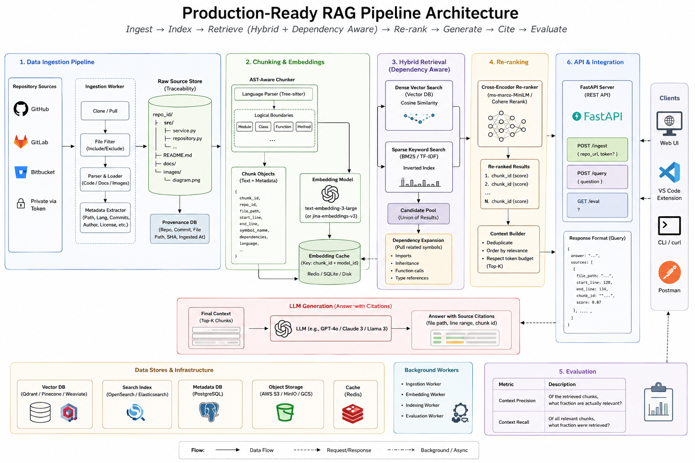

# Production-Ready Hybrid RAG for noisy Codebase

A modular implementation: ingest remote repositories, create AST-aware code chunks, run dense + sparse hybrid retrieval, expand through symbol dependencies, rerank candidates, generate grounded answers, and evaluate context precision/recall.



## Features

- GitHub, GitLab, and Bitbucket cloning over HTTPS; optional private-repository token.
- Provenance stored for repository, commit, file path, line range, symbol, and chunk ID.
- Python AST chunking plus Tree-sitter parsing for common languages; safe fallback windows for unsupported or malformed files.
- Dense vector search using Sentence Transformers and local Qdrant.
- Sparse BM25 search with reciprocal-rank fusion.
- Dependency-aware expansion through imports, symbol references, and function calls.
- Cross-encoder reranking before context-budget enforcement.
- OpenAI answer generation with strict source grounding; retrieval-only fallback when no key is configured.
- FastAPI endpoints: `POST /ingest`, `POST /query`, `GET|POST /eval`.
- Evaluation framework for Context Precision@K and Context Recall@K.

## Project structure

```text
app/
├── api/routes.py              # FastAPI routes
├── core/config.py             # environment configuration
├── domain/models.py           # internal dataclasses
├── domain/schemas.py          # request/response models
├── services/
│   ├── repository.py          # clone/pull Git repositories
│   ├── chunking.py            # AST and Tree-sitter chunking
│   ├── indexing.py            # embeddings + Qdrant
│   ├── retrieval.py           # BM25, dense fusion, dependency graph, reranking
│   ├── generation.py          # context budget + grounded LLM answer
│   ├── evaluation.py          # precision/recall evaluation
│   └── pipeline.py            # orchestration
├── storage/
│   ├── database.py            # SQLAlchemy metadata store
│   └── chunk_store.py         # chunk persistence
└── main.py                    # application entrypoint

data/eval/sample_qrels.jsonl   # evaluation dataset template
docs/architecture.png          # architecture diagram
tests/                         # unit tests
```

